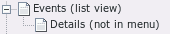
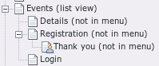
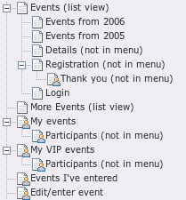

======================
Adding front-end pages
======================

If your site does not use the online registration feature, you have to
explicitly disable that feature.

Your page structure can then look like this:

Usually, you’ll want to use this extension with the online
registration feature. For this, the minimal page structure will look
like this:

For a full-blown registration with several list views, two archive
pages, the “my registrations page” (where a user can see the events to which
they have signed up), registrations lists for participants and s and
front-end editing, the page structure would look like this (usually,
you only need some of these pages):

#. If you want users to be able register manually, then build up a front-
   end user system for your site. Remember which group corresponds to
   “confirmed front-end users.”

#. Add a page (which we called “ ***Events (list view)*** ” in the
   illustrations) that will contain the list view.

#. Add a page (“ ***Details (not in menu)*** ”) that will contain the
   detail view.

#. Add a “Seminar Manager”-plug-in content element to both of these pages
   (from step 2 and 3) and set the corresponding types to “Event
   List”/”Event single view”. Set the content element's ”Starting Point”
   to the SysFolder that contains (or will contain) the seminar records
   (what we called “ ***Event Data*** ” in Illustrations 1-4). The
   element on “ ***Events (list view)*** ” will show the seminar list and
   the detailed seminar view will be shown on “ ***Details (not in
   menu).”*** Usually, this content element doesn't have any access
   restrictions.If you would like to show only the seminars from certain
   organizers, put the seminar records for the organizers on separate
   pages, and add only the corresponding pages as starting pages for the
   plug-in.

#. Add a page (which we called “ ***Registration (not in menu)*** ” in
   the illustrations) that will be the registration page. Important: The
   Seminar Manager creates links to this page (for example from the list-
   and detailed view and as a redirect parameter after login) – this will
   fail if this page is access restricted. Don't hide this page and don't
   apply user restrictions to the page itself! A good way is to mark the
   page as “hide in menu,” but the page must be accessible for all
   visitors, independent of their login status (logged in or not).

#. **New registration form that got introduced in seminars 4.3:**
   Add a plug-in content element and set the type to "Registration form for
   events". Configure it to your needs using the settings in the FlexForms.

#. Add another page that will contain the “my registrations” list (if you want
   to use that feature). Set the page access to “show at any login.”

#. To use the new "my registrations" plugin, add a plug-in content element to
   that page. Save it and set the type to “My registrations”.

#. Alternatively, to use the legacy "my events" plugin:
   Add a “Seminar Manager”-plug-in content element to that page and set
   the type to “My Events”. Set the content element's start pages to the
   page or pages that contain (or will contain) the seminar records. This
   element then works like the “Event List” content type, but it will
   only show those events to which the currently logged-in front-end user
   has signed up. If you want this list to show all events instead of
   current and upcoming, set “Only show events from this time-frame” to
   “all events” (you'll probably want to do this).
