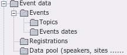
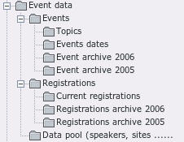
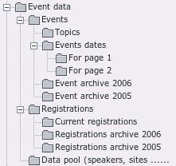
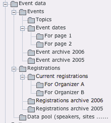

Creating system folders
^^^^^^^^^^^^^^^^^^^^^^^

In addition to the  *website\_users\_folder* , you need to create some
system folders for storing records needed by this extension.

If you don’t have many events and you can keep the overview even if
the event dates and the registrations are on one page each, you can
create a minimal SysFolder structure like this:

If you have only one page with one list view for the events, you can
have all current event records in one system folder:

If it is okay for to have the registrations for all organizers arrive
in one system folder or if you have only one organizer, you only need
one folder for the registrations:

The following system folder structure is proposed for a full-blown installation with lots of events and different organizers that manage their registrations independently:

If you create these folders outside of the site root page with the
template, you still need to create a template for them and “include
static (from extensions)” in that template, or else the back-end
module will not be able to use the extension's default configuration
(e.g., the date and time format, so that date won't get displayed in
the back-end module).

