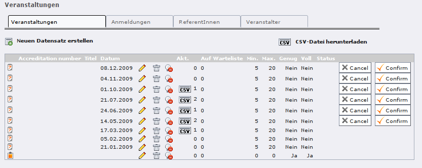
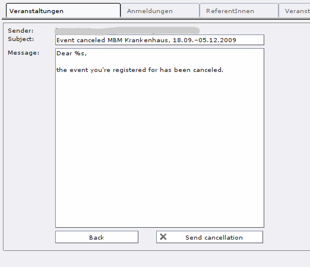
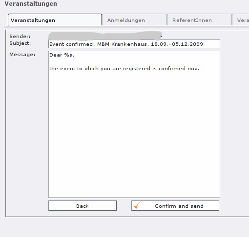
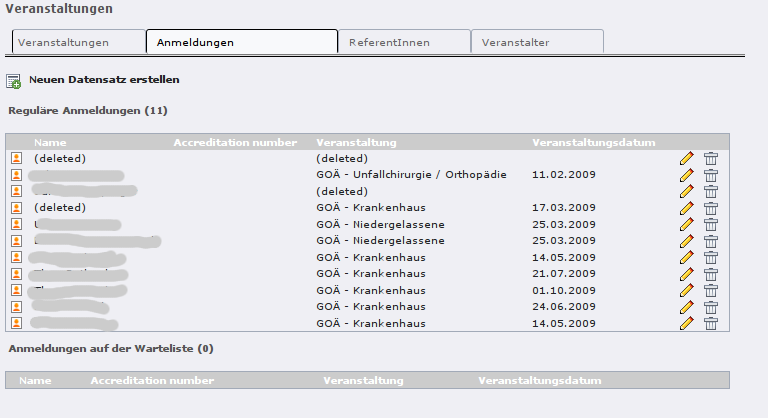

The back-end module “Events”
^^^^^^^^^^^^^^^^^^^^^^^^^^^^

This module provides easy-to-use access on event records, organizers,
speakers and registrations.

**Important: Only the records of the currently selected sysfolder get
displayed.** This means that you need to select different sysfolders
if your records are located in several sysfolders (for examples you
registrations might be places somewhere different than your event
records).

Records that are created via this back-end module are saved in the
currently selected sysfolder, too.

Tab: Events
"""""""""""

.. ### BEGIN~OF~TABLE ###

.. container:: table-row

   Column/GUI element
         Column/GUI element

   Meaning
         Meaning

.. container:: table-row

   Column/GUI element

   Meaning
         creates a new event record in the selected sysfolder

.. container:: table-row

   Column/GUI element
         download as CSV

   Meaning
         downloads all events as CSV file which can be opened e.g. in Excel

.. container:: table-row

   Column/GUI element

   Meaning
         Record type:

         .. ### BEGIN~OF~TABLE ###

         .. container:: table-row

            a

            b
                  Single event

         .. container:: table-row

            a

            b
                  Topic for multiple events

         .. container:: table-row

            a

            b
                  Date (for a topic)

         .. ###### END~OF~TABLE ######

.. container:: table-row

   Column/GUI element
         accreditation number

   Meaning
         manually assigned number for an event (can also be empty)

.. container:: table-row

   Column/GUI element
         title

   Meaning
         the event’s title

.. container:: table-row

   Column/GUI element
         date

   Meaning
         the event’s date

.. container:: table-row

   Column/GUI element

   Meaning
         edit an event

.. container:: table-row

   Column/GUI element

   Meaning
         delete an event

.. container:: table-row

   Column/GUI element

   Meaning
         temporarily hide an event

.. container:: table-row

   Column/GUI element
         act.

   Meaning
         the current number of registrations; the CSV button creates
         the registration as a CSV download which can be opened e.g. in Excel

.. container:: table-row

   Column/GUI element
         queue

   Meaning
         the number of registrations on the waiting list (if the event has a
         waiting list)

.. container:: table-row

   Column/GUI element
         min.

   Meaning
         how many registrations are needed for the event to take place

.. container:: table-row

   Column/GUI element
         max.

   Meaning
         how many seats there are for this event in total

.. container:: table-row

   Column/GUI element
         enough

   Meaning
         whether the event has enough registrations to take place

.. container:: table-row

   Column/GUI element
         full

   Meaning
         whether the event is fully-booked

.. container:: table-row

   Column/GUI element
         status

   Meaning
         canceled, confirmed or planned (neutral)

.. container:: table-row

   Column/GUI element
         Button “cancel”

   Meaning
         cancels the event and send and email to all registered participants
         (using an email form)

.. container:: table-row

   Column/GUI element
         Button “confirm”

   Meaning
         marks the event as confirmed and send and email to all registered
         participants (using an email form)

.. ###### END~OF~TABLE ######

Canceling an event
""""""""""""""""""

If an event needs to be canceled, you can cancel it by clicking on the
“Cancel” button. This also sends an email to all registered
participants:

In the email form, there already is a default text which you can edit
before sending the email. The placeholder **%s** will automatically
be replaced with the participant’s name.

A canceled event still will be visible in front end, but is clearly
recognizable as canceled (so that you don’t get tons of “Where can I
find information about the event on the web site?” request after
canceling it ;-) ). Registration for canceled events is not possible.

Marking an event as confirmed
"""""""""""""""""""""""""""""

When you feel sure that an event is certain to take place (if enough
participants have signed up and you’ve got the speakers’ okay), you
can mark an event as confirmed by using the “Confirm” button. This
also sends an email to the registered participants:

Signing up for a confirmed event still is possible (as long as there
are any vacancies); only the text in the confirmation email is a bit
different.

Tab: Registrations
""""""""""""""""""

   Tab "Registrations" in the back-end module “Events”

In this tab,  **all** registration records of the currently selected
folder are displayed (i.e., of all events).

The first list **Regular registrations** contains those registrations
that are not on the waiting list.
